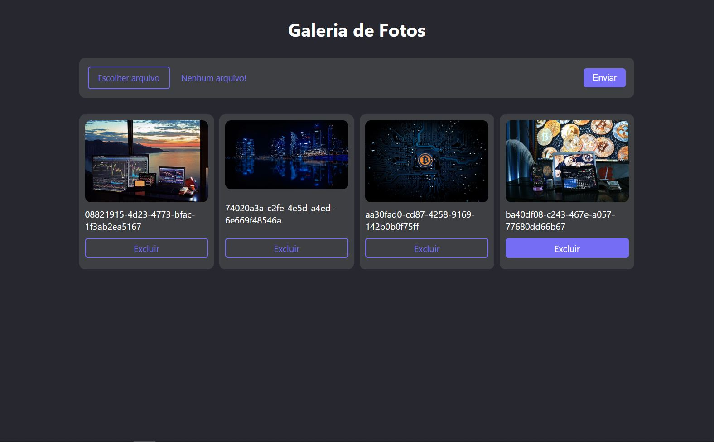
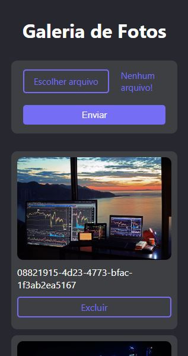

<h1 align="center">
  💻 Projeto
</h1>
<h4 align="center">
  Projeto criado para praticar e elevar conhecimentos e padrões de Desenvolvimento Front-end.
</h4>

## 🔎Preview

<h5 align="center">Desktop</h5>

<h5 align="center">Mobile</h5>

---

## 💼 Tecnologias utilizadas

Para o desenvolvimento deste site utilizei as seguintes tecnologias:

- HTML;

- uuid

- Firebase storage;

- Styled-components;

- TypeScript;

- React.js

  - useState
  - useEffect
  - useRef

  

---

## 📋 Descrição

A ideia do site é ter um projeto de galeria de fotos flexivel, deixando o sistema independente da base de dados, podendo trocar para qualquer uma, tendo apenas que alterar o services do projeto.

Básicamente oque o projeto faz, é buscar as fotos no firebase storage lista-las, dando a opção de excluir uma determinada foto e adicionar uma nova.

---

## ▶Execução

Comandos necessários:

**npm install:** Baixa os pacotes necessários para executar o projeto. 

**npm start:** Sobe o projeto na porta 3000;

